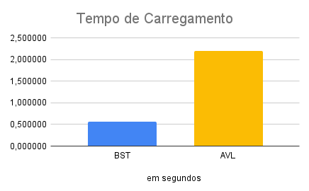
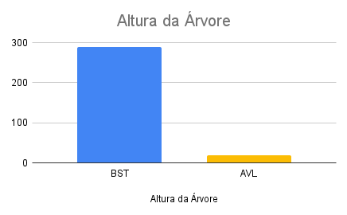
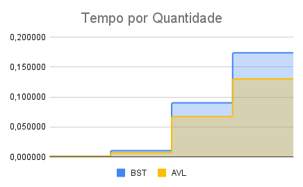

# Projeto 2 
## Algoritmos e Programação
### Mário Yoshiaki Kojima Junior | RA 10082703

## i) método: esclareça, por exemplo, tipo de equipamento utilizado, massa de dados, algoritmos utilizados, linguagem de programação, etc.
```

- Tipo de Equipamento : 
Macbook Pro 
Processador 2.7 GHz Quad-Core Intel Core i7 
Memória 16 GB 2144MHx
MacOS Sonoma 14.7.4

- Massa de Dados
Dataset com base de cidades do Mundo
https://simplemaps.com/data/world-cities
47856 linhas válidas
colunas:
"city",
"city_ascii",
"lat",
"lng",
"country",
"iso2",
"iso3",
"admin_name",
"capital",
"population",
"id"

- Linguagem de Programação
Python 3.09

```

## ii) gráficos com as comparações de tempos medidos entre Árvore AVL e Árvore Binária de Busca para a BUSCA.
### Repositírio com código implementado:

https://github.com/mariokojima/projeto2_algoritmos


### Tempo de carga (inserção da massa)

- BST: 0.557183 segundos
- AVL: 2.194416 segundos




### Altura da Árvore

- BST: 290
- AVL: 19



### Tempo de Busca

Tempo total de 100 buscas
- BST: 0.001141 segundos (0.00001141 segundos por busca)
- AVL: 0.001038 segundos (0.00001038 segundos por busca)

Tempo total de 1000 buscas
- BST: 0.015193 segundos (0.00001519 segundos por busca)
- AVL: 0.009101 segundos (0.00000910 segundos por busca)

Tempo total de 10000 buscas
- BST: 0.121383 segundos (0.00001214 segundos por busca)
- AVL: 0.079656 segundos (0.00000797 segundos por busca)

Tempo total de 20000 buscas
- BST: 0.205426 segundos (0.00001027 segundos por busca)
- AVL: 0.169614 segundos (0.00000848 segundos por busca)




## iii) análise crítica sobre a eficiência dos algoritmos para inserção e para busca. 

A diferença drástica nas alturas (BST 290 vs 19 AVL) demonstra claramente o trade-off: a simplicidade da BST levou a uma degradação de performance devido à sua altura descontrolada. A complexidade da AVL, embora custosa na inserção, foi crucial para garantir uma estrutura compacta (baixa altura) e, consequentemente, um desempenho de busca eficiente e confiável (logarítmico). Para dados que podem gerar desbalanceamento, o custo da AVL é justificado pela performance garantida.


## iv) análise crítica sobre a análise assintótica e os tempos obtidos.
### Árvore Binária (BST)

Melhor Caso: O(1) - O elemento procurado é a raiz da árvore.
Caso Médio: O(log n) - Assume-se que a árvore está razoavelmente balanceada (o que acontece, em média, com inserções aleatórias). A cada passo, metade da subárvore restante é descartada.
Pior Caso: O(n) - Acontece quando a árvore degenera em uma estrutura semelhante a uma lista ligada (por exemplo, inserindo chaves em ordem estritamente crescente ou decrescente). Neste caso, a altura h torna-se n, e a busca pode precisar percorrer todos os nós.


### AVL

Melhor Caso: O(1) - O elemento é a raiz.
Caso Médio: O(log n) - A busca segue um caminho da raiz até uma folha (ou o nó).
Pior Caso: O(log n) - Como a altura é sempre logarítmica, a busca nunca levará mais que tempo logarítmico. Não existe pior caso O(n) para busca em AVL.


 A AVL oferece garantia de desempenho O(log n) ao custo de uma implementação mais complexa,enquanto a BST é mais simples com pequena redução no desempenho

## v) Discussão de como seria montada cada árvore com buscar feitas por outro campo que não seja a chave.

Seria necessária a criação de novas árvores (uma para BST e outra para AVL).

Estrutura: 
Nesta nova árvore:
- A chave seria o nome da cidade (string).
- O valor poderia ser o ID original ou o objeto {"name": ...} completo.

Performance:
- AVL (por Nome): Garantiria buscas por nome em tempo O(log n).
- BST (por Nome): Teria busca por nome em O(log n) em média, mas O(n) no pior caso (se nomes forem inseridos em ordem alfabética).

Desvantagem: 
Requer mais memória (para a segunda árvore) e tempo de construção adicional.